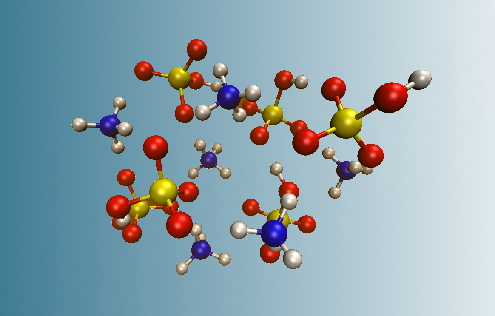

# Clusterin'Clusters



>Vitus Besel, Matias Jääskeläinen, Ilaria Pia
University of Helsinki

Some kind of structure will be

- Prerequisites:  
  - ABCluster (http://www.zhjun-sci.com/software-abcluster-download.php) + XTB (https://pubs.acs.org/doi/10.1021/acs.jctc.8b01176)
- Cleaning Data:  
  - bash scripts collecting it in appropriate files  
  - Forming a nice pandas data frame  
  - Applying statistical and machine learning methods  


## Introduction

Atmospheric science has become increasingly popular especially in the face of climate change and a growing environmental awarness in society. In order to understand the highly complex processes happening in the atmosphere it is not only necessary to conduct fieldwork and measurements, it is also important to deliver the theoretical framework in order to perform simulations complementing the fieldwork or making large scale predictions. One subfield of atmospheric sciences deals with New Particle Formation, which is the formation of particles from single gaseous molecules in the atmosphere, which then can grow further into cloud condensation nuclei. As aerosol- and aerosol-cloud interactions still contribute to the highest uncertainties within current climate models ([1](https://www.ipcc.ch/report/ar5/wg1/anthropogenic-and-natural-radiative-forcing/)) this subfield of New Particle Formation is an especially interesting research object.

#### Configurational Sampling

In order to understand how single gaseous molecules form first molecular cluster and then bigger particles, it is necessary to know the structure of these molecular clusters. However, with an increasing number of molecules inside of an atmospheric cluster, the number of possible conformers rises rapdily. More simply put there are *e.g.* for a molecular cluster made of six sulfuric acid and six ammonia molecules tens of thousands possible ways to form, differing in distances, angles or protonation states of single molecules. *Configurational Sampling* is a method to obtain the relevant local minima structures -*i.e.* the energetically most favorable ones - by a combination of computational chemistry methods and data analysis. This is needed because mainly these minima structures are present in the atmosphere and therefore relevant for atmospheric simulations.

#### ABCluster and GNF-*x*TB

Our code comes into action after to programs have provided the set-up for the Configurational Sampling. ABCluster is utilizes the artificial bee colony algorithm ([2](http://www.zhjun-sci.com/software-abcluster-download.php)) a generic algorithm which takes the structures of single gaseous molecules given by the user and combines them to molecular clusters and optimizes these structures on a [Molecular Mechanics](https://en.wikipedia.org/wiki/Molecular_mechanics) level of theory. It does this in a way which samples the whole [Configurational Space](https://en.wikipedia.org/wiki/Configuration_space_(physics)) and produces an amount of local minima defined by the user (typically 2000 - 100 000). Further the semi-empirical method GNF-*x*TB is used to once again optimize these structures on a better level of theory. We assume that these steps are conducted by the user within the [Jammy Key for Configurational Sampling (JKCS)](https://pubs.acs.org/doi/10.1021/acs.jpca.9b03853))

## What the code does?

#### Objective

After ABCluster and GNF-*x*TB within JKCS the user is left with thousands of output (.log) files and structure (.xyz) files in a certain directory structure. **Clusterin' Clusters** which collects these files in an organized manner, extracts the relevant variables from these files (cartesian coordinates, dipoles and energies) and gives a ...

The 

reads data in
makes a .csv-file that contains:

Header row: ``` Filename,LogPath,XYZPath,Dipole,Energy ```


| Filename | LogPath | XYZPath | Dipole| Energy |
|------|------|------|------|------|
| Name of the cluster | path to .log-file | path to .xyz-file | Dipole moment value | Energy value |

## Statistical methods

### Data exploration
As a basic data exploration we return a plot of the distributions of the variables Energy and Dipole and a plot of the correlation among all variables of the dataset as a measure of the linear dependency between the variables.

### Principal Components Analysis
The Principal components analysis (PCA) is a tool used to reduce the dimensionality of the data that tries to preserve as much information as possible.    

These two goals in PCA are pursued by means of a transformation of the original variables into new variables, called Principal Components (PCs) that consists of a linear combination of the original variables.
PCs are uncorrelated and arranged in order of decreasing variance, so that the first PCs account for most of the variation in the sample.     

Assuming we want to reduce the number of our original p variables to k<p variables, the PCA method can be formalized as follows:  

   •  1st PC: determine the coefficients of the linear combination      
    that maximize  under the constraint   
   •  2nd PC: determine coefficients of the linear combination
        
        that maximize   under the constraint  and    

   •  proceed in a similar fashion for all other components...   

The final output is a set of p uncorrelated variables with decreasing variance:  such that  and  for j ≠ k.


We apply PCA to our coordinates variables, and select new variables, that explain at least 80% of the variability of our data. The variables Dipole and Energy are kept unchanged so that we won't lose their intrinsic meaning.

### Clustering with k-Means
In order to reduce the variety of the observations we cluster the data, by using a k-mean algorithm, that is a non-hierarchical method of clustering, i.e. the number k of groups is assumed to be fixed.
The algorithm, introduced by MacQueen in 1967, consists of assigning each datapoint to the cluster whose centroid (i.e. vector of means) is the closest one.  The metric used to measure the distance among groups is typically the Euclidean one. \newline
It can be represented as follow:

   1. Initial partition into K clusters, (possibly randomly generated)
   2. For each of the K clusters, compute the cluster centroid.
   3. Assign each observation to the cluster whose centroid is closest
   4. Recompute centroids for all clusters
   5. Repeat 3. - 4. until reaching a maximum number of iterations or when it is not possible to redistribute observations


As stated above a crucial parameter is the number of groups k. If such parameter is not clearly recoverable from the data itself, a good criteria to chose the optimal one,  is to find a balance between low within-cluster variation and number of groups. A common method is to select the number of clusters k that maximize the Calinksi-Harabasz (CH) index:

  

where n is the data points, k the number of clusters, W(k) the within cluster variation and B(k) the between cluster variation.

As the resulting clusters depend strongly on the choice of the starting centroids a common practice is to repeat the algorithm several times with different starting centroids, randomly generated.


We applied the k-mean algorithm to our data, selecting a number of clusters k=23 as this is the number of possible permutations of our chemical cluster: there are 23 different ways of adding 4 water molecules, 1 ammonia and 1 sulfuric acid. The possibility to select k according to the CH index is also given.

### Visualization with t-SNE
To visualize the multidimensional dataset we use the t-Distributed Stochastic Neighbor Embedding (t-SNE), an unsupervised, non-linear technique of dimensionality reduction, introduced by Laurens van der Maatens and Geoffrey Hinton in 2008.   
The t-SNE aims to preserve the similarity between the original d-dimensional points and the 2-dimensional points returned as an output. As a measure of similarity we take conditional probability under specific kernels.
The algorithm can be divided in three steps.  

First we convert the high-dimensional Euclidean distances between d-dimensional datapoints  into conditional probabilities  that represent the probability that  would pick  as its neighbor if neighbors were picked in proportion to their probability density under a Gaussian centered at .

In the same way, we convert the Euclidean distances between 2-dimensional points  into conditional probabilities  that give the probability that  would pick  as its neighbor if neighbors were picked in proportion to their probability density under a Chaucy distribution centered at .

Finally, to measure the difference between the probability distributions of the d-dimensional and the 2-dimensional points we use the Kullback-Liebler divergence (KL) :   

   

T-SNE minimizes the sum of Kullback-Leibler divergences over all datapoints using a gradient descent method.   

A plot of the clustered datapoints in the 2-dimensional t-SNE space is given as a final output.


## Outcomes

How do we present it in a website/Manual | How do we sell it?i
Prerequisites
ABCluster employs a generic algorithm -> generates molecular clusters from cluster monomers. + Optimization on MM level
XTB is a semi-empiric method
Preparing data
Nam liber tempor cum soluta nobis eleifend option congue nihil imperdiet doming id quod mazim placerat facer possim assum. Typi non habent claritatem insitam; est usus legentis in iis qui facit eorum claritatem. Investigationes demonstraverunt lectores legere me lius quod ii legunt saepius.
Collecting and sorting files
Duis autem vel eum iriure dolor in hendrerit in vulputate velit esse molestie consequat, vel illum dolore eu feugiat nulla facilisis at vero eros et accumsan.
Creating a suitable data frame
Applying statistical and machine-learning methods
Nam liber tempor cum solu
Discussion
Does it work? In which ways?
Publication
How do we present it / publish it?
